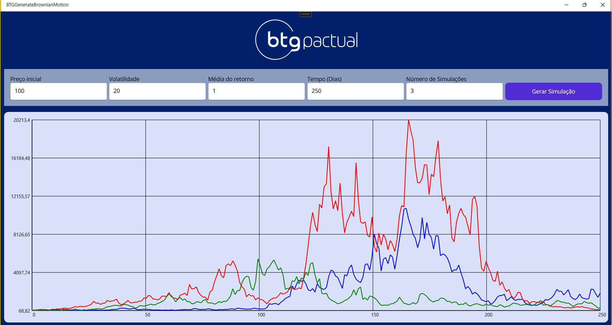

# 💹 BTG Generate Brownian Motion

Aplicação desenvolvida como parte do desafio técnico do BTG Pactual, utilizando .NET MAUI para simular e visualizar graficamente 
o **movimento browniano geométrico** — uma técnica amplamente utilizada para modelar o comportamento estocástico de preços no mercado financeiro.

---

## 📌 Objetivo

Criar uma aplicação **.NET MAUI Desktop (Windows)** com interface gráfica que:

- Recebe parâmetros financeiros como entrada
- Simula o comportamento do preço de um ativo ao longo do tempo usando movimento browniano
- Plota os resultados graficamente utilizando `GraphicsView` e `IDrawable`

---

## 🛠️ Tecnologias e padrões aplicados

- **.NET 9**
- **.NET MAUI (Windows)**
- **MVVM** (Model-View-ViewModel) com `CommunityToolkit.Mvvm`
- `GraphicsView` + `IDrawable` para renderização gráfica
- C# 12
- Suporte a múltiplas simulações e exibição simultânea no gráfico

---

## 🧪 Parâmetros configuráveis

O usuário pode configurar diretamente pela interface:

- 📈 Preço inicial
- 📊 Volatilidade (%)
- 📉 Média de retorno (drift) (%)
- 🗓️ Tempo (em dias)
- 🔁 Número de simulações a serem plotadas

---

## 💡 Funcionalidades

- Geração do gráfico com base no modelo de **Movimento Browniano Geométrico**
- Entradas com validação dinâmica e tratamento de erros
- Permite múltiplas simulações e exibição de várias curvas
- Design responsivo com layout adaptado para desktop

---

✨ Melhorias possíveis (opcionais do desafio)
✅ Múltiplas simulações (implementado)

✅ Escalas vertical e horizontal no gráfico(implementado)

⬜ Personalização visual do gráfico (cores, estilos)

⬜ Componentes mais ricos como Slider, Stepper

⬜ Testes unitários

✅ Suporte à responsividade dinâmica(implementado)

⬜ Tema claro/escuro

## 🖥️ Interface da Aplicação

